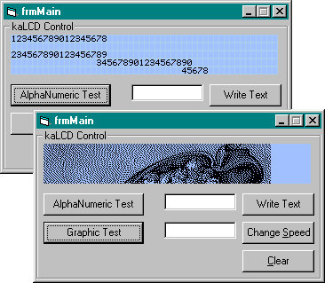



## LCD Control

### Description

a Liquid Character Display with the ability to display a picture too. check out picture.

BIG thanx to Omar Al Zabir for his HIve class and to Manuel Augusto Santos for his Fast Graphics Filters (partly used). ANY feedback is welcome.
 
### More Info
 

             |
---                |---
**Submitted On**   |2002-03-01 21:50:28
**By**             |[Killer Angel](https://github.com/Planet-Source-Code/PSCIndex/blob/master/ByAuthor/killer-angel.md)
**Level**          |Intermediate
**User Rating**    |4.9 (98 globes from 20 users)
**Compatibility**  |VB 6\.0
**Category**       |[Custom Controls/ Forms/  Menus](https://github.com/Planet-Source-Code/PSCIndex/blob/master/ByCategory/custom-controls-forms-menus__1-4.md)
**World**          |[Visual Basic](https://github.com/Planet-Source-Code/PSCIndex/blob/master/ByWorld/visual-basic.md)
**Archive File**   |[LCD\_Contro58627312002\.zip](https://github.com/Planet-Source-Code/killer-angel-lcd-control__1-32233/archive/master.zip)

